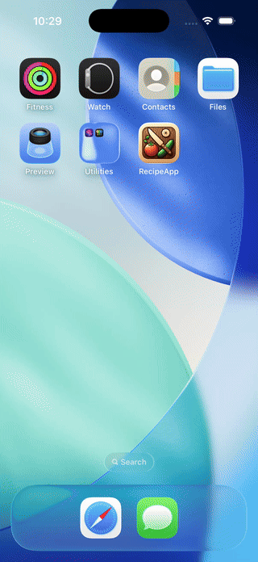
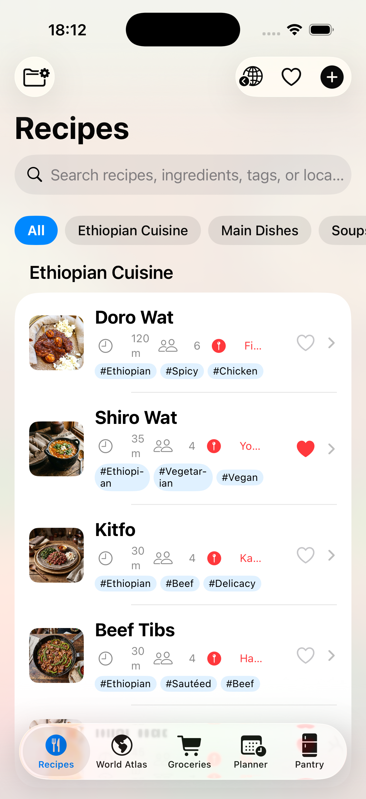
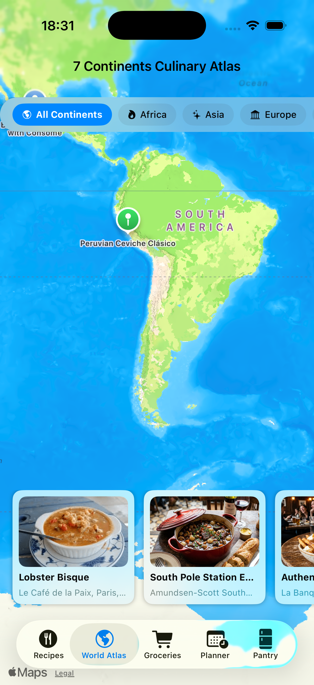
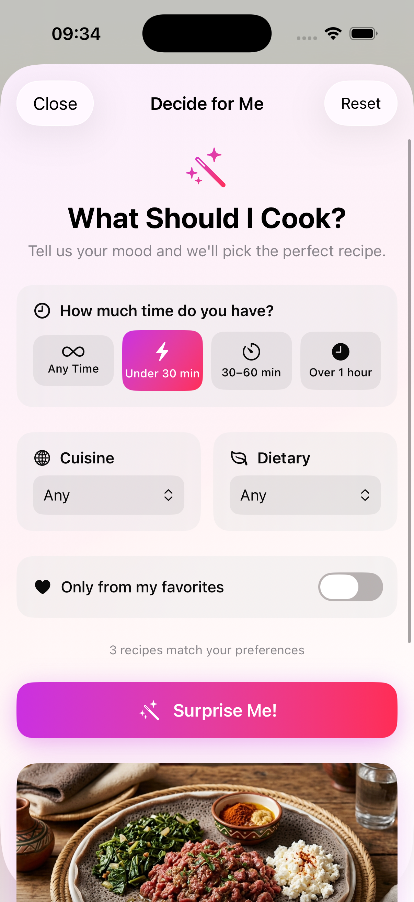

# 🌍 RecipeApp: 7 Continents Culinary Suite

A professional iOS culinary application built entirely with **SwiftUI** and **SwiftData**. This app allows users to explore recipes across all 7 continents with a rich set of features tailored for the ultimate cooking experience.

## ✨ Features

- **🗺️ Global Culinary Map Explorer**: Interactive 3D Apple Maps integration to explore dishes worldwide. Features 7-continent quick navigation chips, custom marker tints, and a beautiful bottom-sheet card UI.
- **🛒 Smart Grocery List**: Automatically scales ingredients based on serving size. Generates aisle-categorized shopping lists with Apple Reminders integration.
- **📅 Weekly Meal Planner**: Intuitive 7-day calendar to assign recipes. One-tap generation of the entire week's grocery list.
- **🧊 Pantry Matcher**: "What's in My Fridge?" feature with a matching algorithm. Add your pantry staples and discover recipes you can cook *right now*.
- **🗣 Hands-Free Cooking Mode**: A distraction-free, large-text UI powered by `AVSpeechSynthesizer`. Swipe gestures and voice readout of cooking steps prevent you from touching your phone with messy hands.
- **🌐 Web Recipe Importer**: Paste a URL to scrape and parse standard JSON-LD schema or Open Graph meta tags, seamlessly importing internet recipes directly into your SwiftData container.
- **📊 Nutrition Charts & PDF Export**: Rich Swift Charts displaying macro breakdowns, dietary badges (Vegan, Gluten-Free, Keto, etc.), and native PDF generation for beautifully printed recipe cards.

## 📱 Screenshots & Previews

### 🚀 Premium Animated Splash Screen


### 🍽️ Recipe Explorer & Features
<p float="left">
  
   
  
</p>

*(More screenshots like Grocery List and Pantry Matcher coming soon)*

## 🚀 Getting Started

### Prerequisites
- macOS Sonoma (or later)
- Xcode 15+ 
- iOS 17.2+ target

### Running the App Locally
1. Clone the repository:
   ```bash
   git clone https://github.com/your-username/RecipeApp.git
   ```
2. Open the project in Xcode:
   ```bash
   cd RecipeApp
   open RecipeApp.xcodeproj
   ```
3. Build & Run (⌘+R).
   Alternatively, you can use the provided bash script:
   ```bash
   ./run_recipe_app.sh
   ```

### Architecture
- **SwiftData**: Core local persistence for recipes, ingredients, steps, groceries, meal plans, and pantry items.
- **SwiftUI**: 100% declarative UI leveraging `.ultraThinMaterial`, `NavigationStack`, `MapKit`, and modern modifiers.
- **AVFoundation**: For the voice-assisted cooking mode.

## 📄 License
This project is licensed under the MIT License - see the [LICENSE](LICENSE) file for details.
